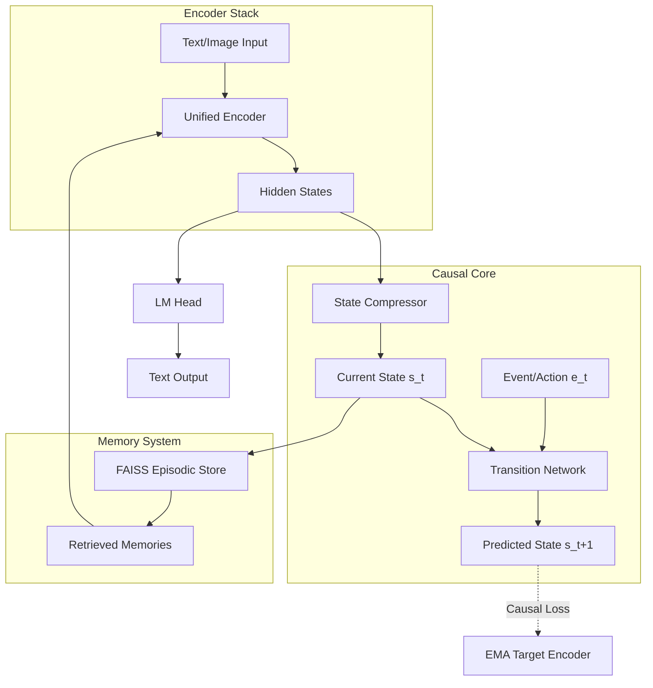

# Aion: Causal-JEPA World Model

[](https://opensource.org/licenses/MIT)
[](https://www.python.org/downloads/)
[](https://pytorch.org/)

**Aion** is an agentic world model built on the Causal-JEPA (Joint-Embedding Predictive Architecture). Unlike standard LLMs that focus purely on next-token prediction, Aion is designed to model the *causal transitions* of world states. It learns to understand how an "event" (instruction or action) transforms a current "observation" into a future "outcome."

## 🚀 Key Highlights

- **Causal State Compression**: Uses attention-pooling to compress long observation sequences into singular, high-density causal state vectors.
- **Infinite Episodic Memory**: Integrated FAISS-backed memory system that allows the model to "remember" and retrieve past interactions dynamically, extending its context window infinitely.
- **JEPA-Style Training**: Employs an Exponential Moving Average (EMA) target encoder to provide stable prediction targets, preventing representational collapse without needing expensive contrastive pairs.
- **Extreme Efficiency**: Achieves GPT-2 level linguistic coherence and instruction following with significantly less training data than traditional pre-trained transformers.

---

## 🏗 Architecture

Aion uses a unified transformer backbone with modern improvements including **RoPE** (Rotary Positional Embeddings), **GQA** (Grouped Query Attention), and **SwiGLU** activations.



---

## 🛠 Quick Start

### 1. Installation
```bash
git clone https://github.com/DavidAtanoff/Aion.git
cd Aion
pip install torch transformers datasets faiss-cpu
```

### 2. Training (Kaggle / Multi-GPU)
Aion is optimized for training on Kaggle's 2x T4 GPUs.
```bash
# To bundle the source into a single file for Kaggle utilities
python compile.py

# To start training with DDP
torchrun --nproc_per_node=2 kaggle_train.py --ddp --scale base
```

### 3. Usage
```python
from src.model.world_model import CausalWorldModel
from src.utils.config import WorldModelConfig

# Load configuration (tiny, base, large, xl)
config = WorldModelConfig.base()
model = CausalWorldModel(config)

# Generation with Infinite Memory
output = model.generate(input_ids, use_memory=True)
```

---

## 📊 Training Objectives

Aion optimizes four joint losses:
1. **$L_{causal}$**: Predicting the next latent state $s_{t+1}$ from current state $s_t$ and event $e_t$.
2. **$L_{lm}$**: Standard next-token prediction to maintain linguistic fluency.
3. **$L_{align}$**: Cross-modal delta alignment (aligning how text and images change over time).
4. **$L_{cf}$**: Counterfactual calibration (distinguishing between real and imaginary outcomes).

## 📄 License
This project is licensed under the MIT License - see the [LICENSE](LICENSE) file for details.
